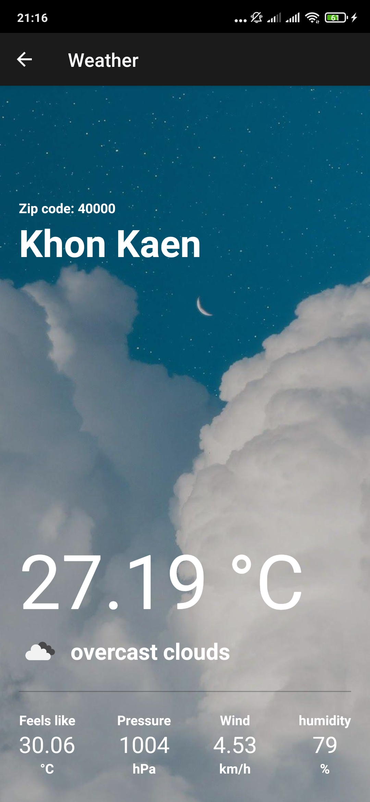

# 2SA04 React-Native
_น.ส.คริสต์มาส วีรชิตอรกานต์ 6210110036 sec 02_
## หน้า Home
* เพิ่มหัวข้อ City และ Zip code
* แต่งให้มีเส้นขอบ
* เพิ่มจังหวัด

## รูปพื้นหลังเปลี่ยนตามชนิดสภาพอากาศ
* ถ้าชนิดเป็น Clouds พื้นหลังจะเป็นรูปท้องฟ้ามีเมฆ
* ถ้าชนิดเป็น Rain พื้นหลังจะเป็นรูปฝนตก

## แสดงรายละเอียดข้อมูลเพิ่มเติม
### ดึงข้อมูลสภาพอากาศมาแสดงเพิ่มเติมคือ
* แสดงข้อมูลอุณหภูมิที่รู้สึกได้
* แสดงข้อมูลความกดดันอากาศ
* แสดงความเร็วลม
* แสดงความชื้น

## แสดงไอคอน
* แสดงไอคอนที่เปลี่ยนไปตามสภาพอากาศ
* สภาพอากาศแบบ _scanttered clouds_

* สภาพอากาศแบบ _overcast clouds_

* สภาพอากาศแบบ _loght rain_

### reference:
#### https://www.youtube.com/watch?v=9XarYuINB_c&t=1463s&ab_channel=PradipDebnath

